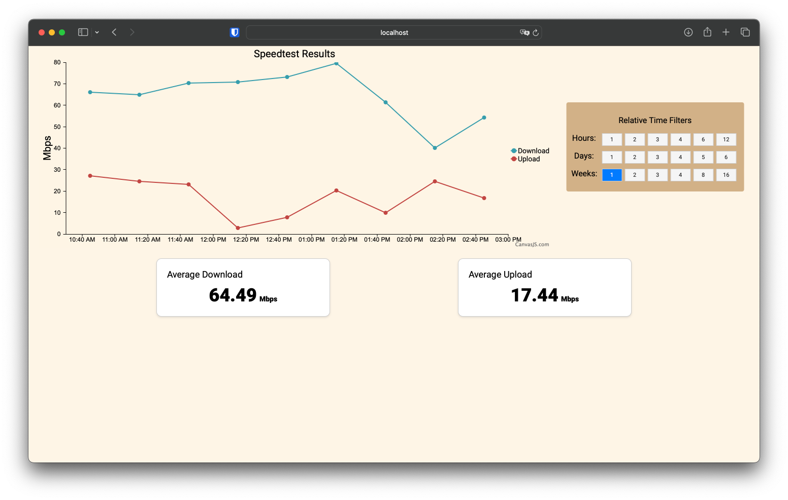

# Internet Speed Monitor Application

This application is designed to monitor internet speed using the speedtest-cli tool and store the results in a SQLite database. It also provides a web frontend for visualizing the internet speed data over time.



## Features

- **Internet Speed Monitoring**: The application runs a cron job every 30 minutes to perform an internet speed test using the speedtest-cli tool.
- **Data Storage**: The results of the speed tests are stored in a SQLite database for historical analysis.
- **Web Frontend**: Provides a user-friendly web interface for visualizing internet speed data over time.
- **Graph Visualization**: The web frontend includes a graph that displays download and upload speeds over time.
- **Time Filtering**: Users can filter the data by time to view internet speed trends for specific relative periods.

## How to run

1. Clone the repository. 
2. Build and run the docker container. 
```bash
cd speedtesting
docker build -t speedtesting .
docker run -d -p 8080:8080 speedtesting
```
3. Open your browser and navigate to `http://localhost:8080` to access the web frontend.


## Database

The Docker image mounts a volume to `/app/db`, where the SQLite database is stored within the Docker container. This volume allows the database to persist even if the container is stopped.


## Technologies Used

- [speedtest-cli]( https://github.com/sivel/speedtest-cli): A command-line interface for testing internet bandwidth using speedtest.net.
- [SQLite](https://www.sqlite.org/index.html): A lightweight, serverless database engine that stores data in a single file.
- [Flask](https://flask.palletsprojects.com/): A web application framework for Python.
- [Chart.js](https://www.chartjs.org/): A JavaScript library for creating interactive charts and graphs.
- [Docker](https://www.docker.com/): A platform for developing, shipping, and running applications in containers.
- [Cron](https://en.wikipedia.org/wiki/Cron): A time-based job scheduler in Unix-like operating systems.


### Roadmap

- Add Ping Latency Monitoring: Include ping latency data in the speed test results and display it in the web frontend.
- Add table showing which servers are being used for the speed tests.